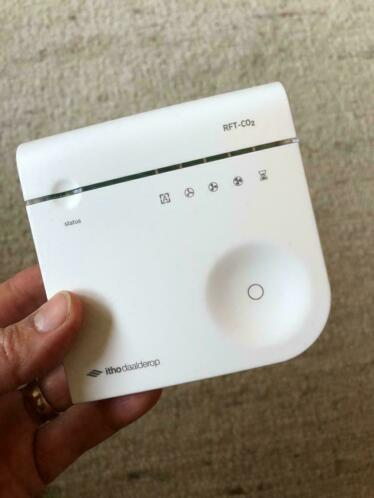
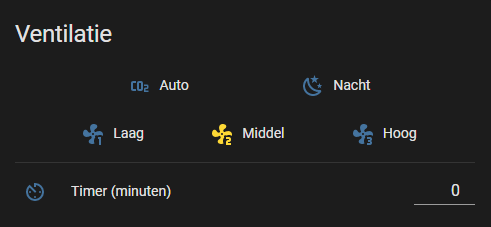

**Not ready for "end users". See [configuring](#configuring) below.**

# What is this?

A library and esphome configuration with which you can control an Itho fan, when you have a setup with an Itho RFT-CO2. One that looks like:



This software is meant to control your fan from within Home Assistant:



# Hardware

You'll need:

 - An ESP8266 of some kind.
    (ESP32 might work as well, but you'll have to figure out the pinout for yourself)
    
 - A CC1101 module that works on 868 MHz. Mine looks like this:
 

Then connect:

| ESP gpio num | ESP pin label | CC1101 pin |
|--------------|---------------|------------|
| Vcc          | 3.3v          | Vcc        |
| Gnd          | Gnd           | Gnd        |
| GPIO13       | D7            | MOSI       |
| GPIO14       | D5            | SCLK       |
| GPIO12       | D6            | MISO       |
| GPIO4        | D2            | GDO2*      |
| GPIO5        | D1            | GDO0       |
| GPIO15       | D8            | CSn        |

*gdo2 is not (yet) used in this library.

# Configuring

For now, this is not ready for "end users". That's because the library needs to be configured with a "start byte", and the addresses of the Itho fan and remote. If I figure out a way to make this easy for you, I'll update this page. Hint, you'll have to update this line in your ithoFan.yaml:
```
auto fan = new IthoFan(5, 0x1C, 0x957D19, 0x9568C4);
```

You'll also need to add a file "secrets.yaml" to the main directory. You need to specify some stuff here:

```yaml
wifi_ssid: "secret wifi name"
wifi_password: "secret password"
api_password: "a password that will give access to your ESP"
ap_password: "another password that will give access to your ESP"
```

# Compiling

Make sure you have Python installed and install esphome (if you haven't already):
```bash
pip3 install esphome
```

Then run either
```bash
esphome run ithoFan.yaml
```

or, in my case on windows:
```bash
python3 -m esphome run ithoFan.yaml
```